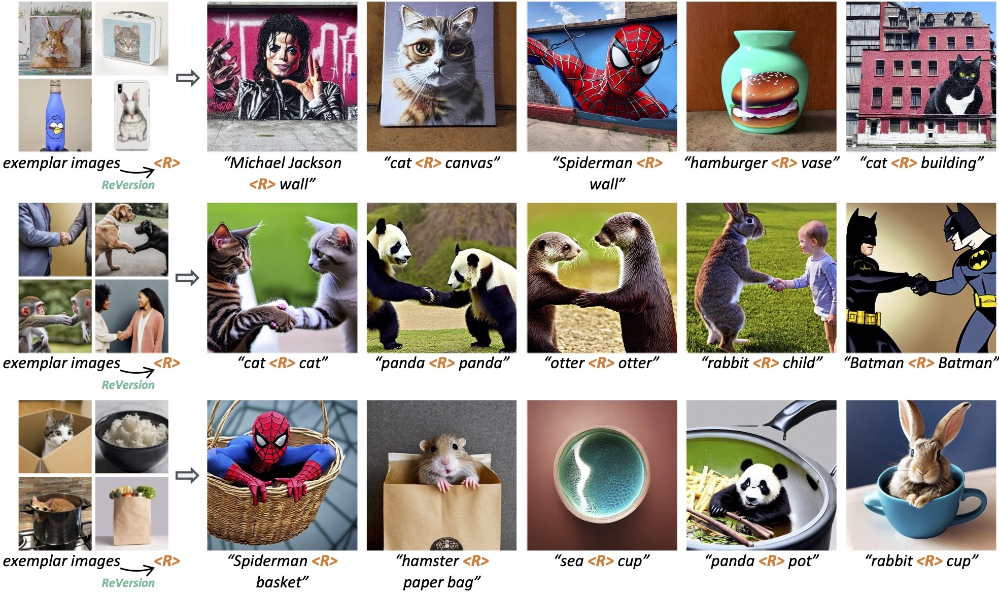
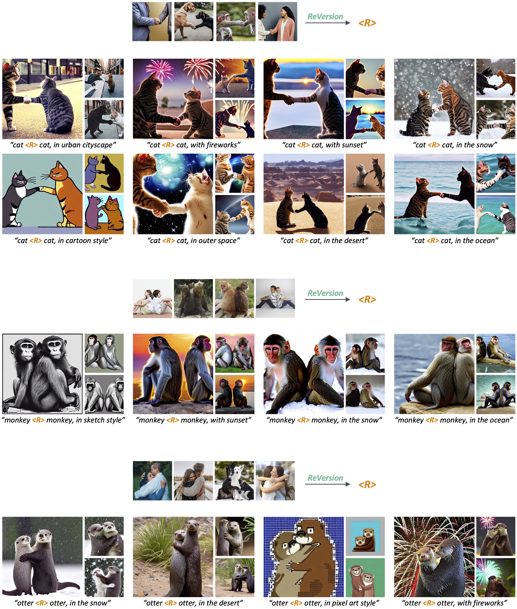

# ReVersion (SIGGRAPH Asia, 2024)

<!--  -->
[](https://ziqihuangg.github.io/papers/2024SigAsia-ReVersion.pdf)
[](https://arxiv.org/abs/2303.13495)
[](https://ziqihuangg.github.io/projects/reversion.html)
[](https://www.youtube.com/watch?v=pkal3yjyyKQ)
[](https://hits.seeyoufarm.com)
[](https://huggingface.co/spaces/Ziqi/ReVersion)

This repository contains the implementation of the following paper:
> **ReVersion: Diffusion-Based Relation Inversion from Images**<br>
> [Ziqi Huang](https://ziqihuangg.github.io/)<sup>∗</sup>, [Tianxing Wu](https://tianxingwu.github.io/)<sup>∗</sup>, [Yuming Jiang](https://yumingj.github.io/), [Kelvin C.K. Chan](https://ckkelvinchan.github.io/), [Ziwei Liu](https://liuziwei7.github.io/)<br>

From [MMLab@NTU](https://www.mmlab-ntu.com/) affiliated with S-Lab, Nanyang Technological University

<!-- [[Paper](https://arxiv.org/abs/2303.13495)] | -->
<!-- [[Project Page](https://ziqihuangg.github.io/projects/reversion.html)] | -->
<!-- [[Video](https://www.youtube.com/watch?v=pkal3yjyyKQ)] |  -->
<!-- [[Dataset](https://drive.google.com/drive/folders/1FU1Ni-oDpxQCNYKo-ZLEfSGqO-j_Hw7X?usp=sharing)]  -->
<!-- [[Huggingface Demo](https://huggingface.co/spaces/Ziqi/ReVersion)] | -->


## :open_book: Overview


We propose a new task, **Relation Inversion**: Given a few exemplar images, where a relation co-exists in every image, we aim to find a relation prompt **\<R>** to capture this interaction, and apply the relation to new entities to synthesize new scenes. The above images are generated by our **ReVersion** framework.

## :heavy_check_mark: Updates
- [12/2024] We are presenting ReVersion at [SIGGRAPH Asia 2024, Tokyo](https://asia.siggraph.org/2024/). Welcome to join our [presentation and discussion](https://asia.siggraph.org/2024/presentation/?id=papers_824&sess=sess105) on 3 December 2024.
- [03/2024] We optimized the code implementation. You only need to save and load the relation prompt, without having to save or load the entire text-to-image model.
- [08/2023] We released the [training code](https://github.com/ziqihuangg/ReVersion/tree/master#relation-inversion) for Relation Inversion.
- [04/2023] We released the [ReVersion Benchmark](https://drive.google.com/drive/folders/1FU1Ni-oDpxQCNYKo-ZLEfSGqO-j_Hw7X?usp=sharing).
- [04/2023] Integrated into [Hugging Face 🤗](https://huggingface.co/spaces) using [Gradio](https://github.com/gradio-app/gradio). Try out the online Demo: [](https://huggingface.co/spaces/Ziqi/ReVersion)
- [03/2023] [Arxiv paper](https://arxiv.org/abs/2303.13495) available.
- [03/2023] Pre-trained models with relation prompts released at [this link](https://drive.google.com/drive/folders/1apFk6TF3pGH00hHF1nO1S__tDlrcLQAh?usp=sharing).
- [03/2023] [Project page](https://ziqihuangg.github.io/projects/reversion.html) and [video](https://www.youtube.com/watch?v=pkal3yjyyKQ) available.
- [03/2023] Inference code released.


## :hammer: Installation

1. Clone Repo

   ```bash
   git clone https://github.com/ziqihuangg/ReVersion
   cd ReVersion
   ```

2. Create Conda Environment and Install Dependencies

   ```bash
   conda create -n reversion
   conda activate reversion
   conda install python=3.8 pytorch==1.11.0 torchvision==0.12.0 cudatoolkit=11.3 -c pytorch
   pip install diffusers["torch"]
   pip install -r requirements.txt
   ```
## :page_with_curl: Usage

### Relation Inversion
Given a set of exemplar images and their entities' coarse descriptions, you can optimize a relation prompt **\<R>** to capture the co-existing relation in these images, namely *Relation Inversion*.


1. Prepare the exemplar images (<em>e.g.</em>, `0.jpg` - `9.jpg`) and coarse descriptions (`text.json`), and put them inside a folder. Feel free to use our ReVersion benchmark, or you can also prepare your own images. An example from our ReVersion benchmark is as follows:
    ```
    .reversion_benchmark_v1
    ├── painted_on
    │   ├── 0.jpg
    │   ├── 1.jpg
    │   ├── 2.jpg
    │   ├── 3.jpg
    │   ├── 4.jpg
    │   ├── 5.jpg
    │   ├── 6.jpg
    │   ├── 7.jpg
    │   ├── 8.jpg
    │   ├── 9.jpg
    │   └── text.json
    ```

2. Take the relation `painted_on` for example, you can start training using this script:
    ```
    accelerate launch \
        --config_file="./configs/single_gpu.yml" \
        train.py \
        --seed="2023" \
        --pretrained_model_name_or_path="runwayml/stable-diffusion-v1-5" \
        --train_data_dir="./reversion_benchmark_v1/painted_on" \
        --placeholder_token="<R>" \
        --initializer_token="and" \
        --train_batch_size="2" \
        --gradient_accumulation_steps="4" \
        --max_train_steps="3000" \
        --learning_rate='2.5e-04' --scale_lr \
        --lr_scheduler="constant" \
        --lr_warmup_steps="0" \
        --output_dir="./experiments/painted_on" \
        --save_steps="1000" \
        --importance_sampling \
        --denoise_loss_weight="1.0" \
        --steer_loss_weight="0.01" \
        --num_positives="4" \
        --temperature="0.07" \
        --only_save_embeds
    ```

    Where `train_data_dir` is the path to the exemplar images and coarse descriptions. `output_dir` is the path to save the inverted relation and the experiment logs. To generate relation-specific images, you can follow the next section [Generation](https://github.com/ziqihuangg/ReVersion/tree/master#generation).

    Note that the `only_save_embeds` option allows you to only save the relation prompt **\<R>**, without having to save the entire Stable Diffusion model. You can decide whether to turn it on.


### :framed_picture: Generation
We can use the learned relation prompt **\<R>** to generate relation-specific images with new objects, backgrounds, and style.

1. You can obtain a learned **\<R>** from [Relation Inversion](https://github.com/ziqihuangg/ReVersion/tree/master#relation-inversion) using your customized data. You can also download the models from [here](https://drive.google.com/drive/folders/1apFk6TF3pGH00hHF1nO1S__tDlrcLQAh?usp=sharing), where we provide several pre-trained relation prompts for you to play with.

2. Put the models (<em>i.e.</em>, learned relation prompt **\<R>**) under `./experiments/` as follows:
    ```
    ./experiments/
    ├── painted_on
    │   ├── checkpoint-500
    │   ...
    │   └── model_index.json
    ├── carved_by
    │   ├── checkpoint-500
    │   ...
    │   └── model_index.json
    ├── inside
    │   ├── checkpoint-500
    │   ...
    │   └── model_index.json
    ...
    ```

3. Take the relation `painted_on` for example, you can either use the following script to generate images using a single prompt, *e.g.*, "cat \<R> stone":
    ```
    python inference.py \
    --model_id ./experiments/painted_on \
    --prompt "cat <R> stone" \
    --placeholder_string "<R>" \
    --num_samples 10 \
    --guidance_scale 7.5 \
    --only_load_embeds
    ```
    Or write a list prompts in `./templates/templates.py` with the key name `$your_template_name` and generate images for every prompt in the list `$your_template_name`:
    ```
    your_template_name='painted_on_examples'
    python inference.py \
    --model_id ./experiments/painted_on \
    --template_name $your_template_name \
    --placeholder_string "<R>" \
    --num_samples 10 \
    --guidance_scale 7.5 \
    --only_load_embeds
    ```
    Where  `model_id` is the model directory, `num_samples` is the number of images to generate for each prompt, and `guidance_scale` is the classifier-free guidance scale.

    We provide several example templates for each relation in `./templates/templates.py`, such as `painted_on_examples`, `carved_by_examples`, etc.

    Note that if you saved the entire model during the inversion process, that is, without the `only_save_embeds` flag turned on, then you should turn off the  `only_load_embeds` flag during inference. 
    The `only_load_embeds` option only loads the relation prompt **\<R>** from the experiment folder, and automatically loads the rest of the Stable Diffusion model (including other text token's embeddings) from the default cache location that contains the pre-trained Stable Diffusion model.


### :hugs: Gradio Demo
- We also provide a Gradio Demo to test our method using a UI. This demo supports relation-specific text-to-image generation on the fly. Running the following command will launch the demo:

    ```
    python app_gradio.py
    ```
- Alternatively, you can try the online demo [here](https://huggingface.co/spaces/Ziqi/ReVersion).

### :art: Diverse Generation
You can also specify diverse prompts with the relation prompt **\<R>** to generate images of diverse backgrounds and style. For example, your prompt could be `"michael jackson <R> wall, in the desert"`, `"cat <R> stone, on the beach"`, <em>etc</em>.




## :straight_ruler: The ReVersion Benchmark
The ReVersion Benchmark consists of diverse relations and entities, along with a set of well-defined text descriptions.

- [<b>Relations and Entities</b>](https://drive.google.com/drive/folders/1FU1Ni-oDpxQCNYKo-ZLEfSGqO-j_Hw7X?usp=sharing). We define ten representative object relations with different abstraction levels, ranging from basic spatial relations (*e.g.*, “on top of”), entity interactions (*e.g.*, “shakes hands with”), to abstract concepts (*e.g.*, “is carved by”). A wide range of entities, such as animals, human, household items, are involved to further increase the diversity of the benchmark.
- [<b>Exemplar Images and Text Descriptions</b>](https://drive.google.com/drive/folders/1FU1Ni-oDpxQCNYKo-ZLEfSGqO-j_Hw7X?usp=sharing). For each relation, we collect four to ten exemplar images containing different entities. We further annotate several text templates for each exemplar image to describe them with different levels of details. These training templates can be used for the optimization of the relation prompt.
- [<b>Benchmark Scenarios</b>](https://github.com/ziqihuangg/ReVersion/blob/master/templates/benchmark_scenarios.py). We design 100 inference templates composing of different object entities for each of the ten relations.

## :fountain_pen: Citation

   If you find our repo useful for your research, please consider citing our paper:

   ```bibtex
   @inproceedings{huang2023reversion,
        title={{ReVersion}: Diffusion-Based Relation Inversion from Images},
        author={Huang, Ziqi and Wu, Tianxing and Jiang, Yuming and Chan, Kelvin C.K. and Liu, Ziwei},
         booktitle={SIGGRAPH Asia 2024 Conference Papers},
        year={2024}
   }
   ```


## :white_heart: Acknowledgement

The codebase is maintained by [Ziqi Huang](https://ziqihuangg.github.io/) and [Tianxing Wu](https://tianxingwu.github.io/).

This project is built using the following open source repositories:
- [Stable Diffusion 1.5](https://huggingface.co/runwayml/stable-diffusion-v1-5)
- [Diffusers](https://github.com/huggingface/diffusers)
